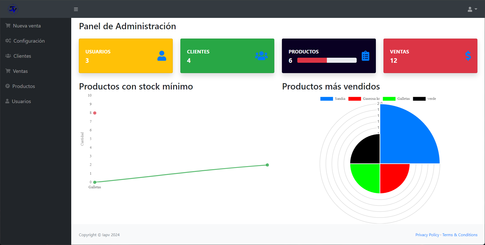

# Project Control de ventas 

> One paragraph statement about the project.

Sistema de ventas con PHP, JavaScript y MySQL, incluyendo funciones de administración de usuarios, productos y ventas, así como la generación de facturas en PDF. El programa brinda funcionalidades para: Proceso de inicio de sesión, registro y modificación de usuarios, proveedores, productos y ventas.

## Built With

- PHP, JavaScript y MySQL
- Para el desarrollo de este proyecto, se utilizó una metodología de trabajo individual, sin seguir un marco de trabajo o metodología ágil en particular. El proceso de desarrollo se llevó a cabo de manera iterativa, con entregas frecuentes y ajustes a medida que se avanzaba en la implementación.

## Getting Started

**Verifica las conexiones al momento de descargar el proyecto:**
**conexion.php, header.php, footer.php**

## Author

👤 **Italo Alejandro Padovan Velasco**

- GitHub: [@aristides1000](https://github.com/Italoapv)
- Ig: [@italo_apv](https://www.instagram.com/italo_apv?igsh=MWNsNDF3b3ZiZnVwdA==)
- LinkedIn: [LinkedIn](https://ve.linkedin.com/in/italo-padovan-483625275?trk=people-guest_people_search-card)

## Show your support

Give a ⭐️ if you like this project!

## Acknowledgments

- Me inspiré de los sistemas de los supermercados para hacer este proyecto.

## 📝 License

This project is [CC0 1.0 Universal](LICENSE) licensed.